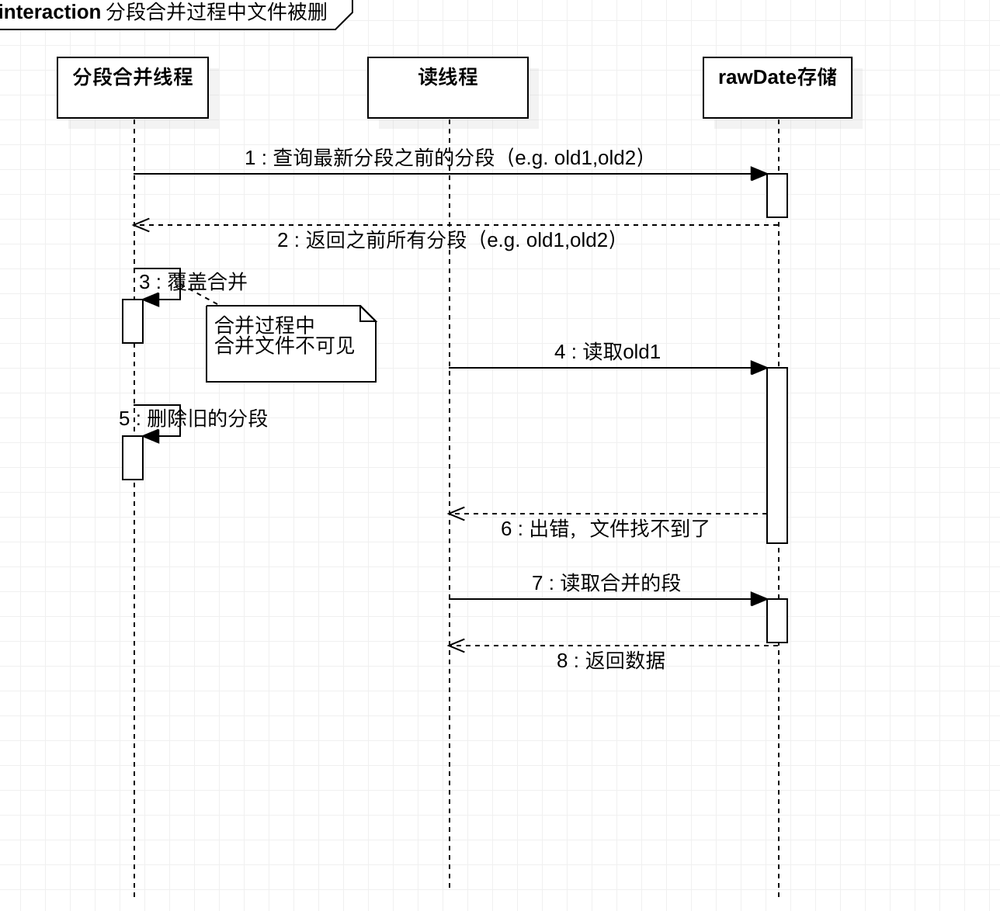
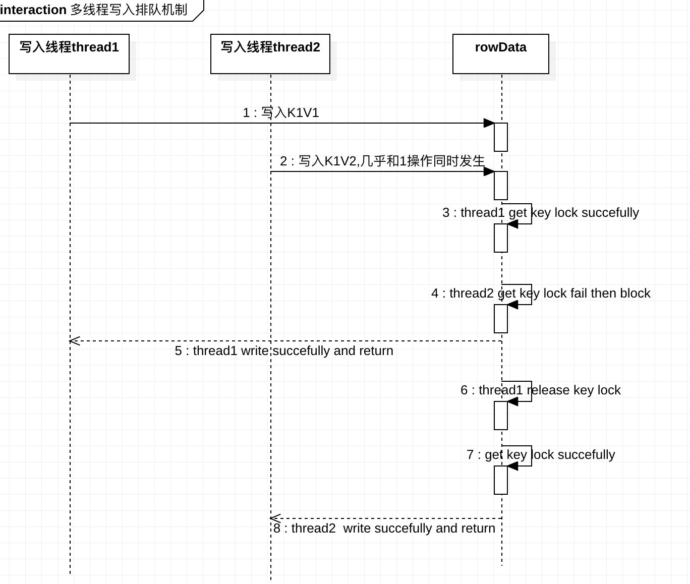
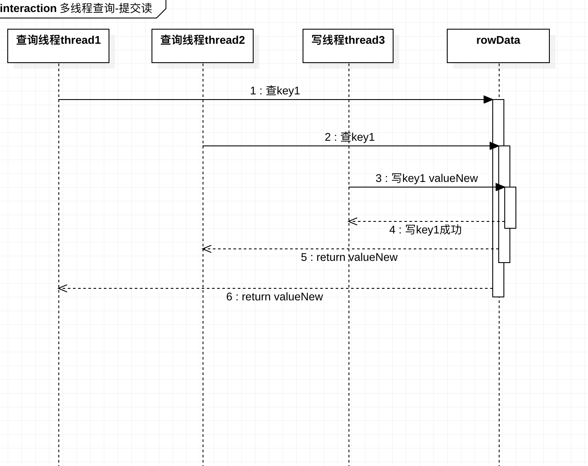
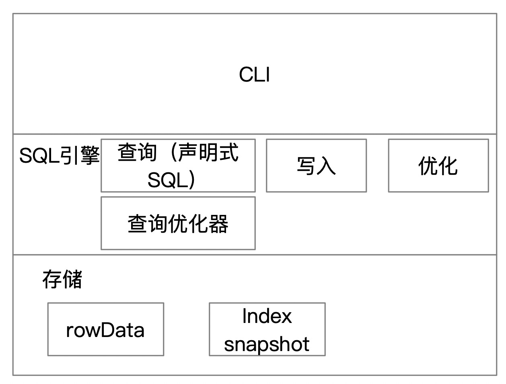

# 基于日志追加实现的简单KV数据库
# 需求描述
- 基本需求
    - 写
    - 读
    - 删除
    - 事务
- 性能优化
    - 索引（hash map <key,offset>）
    - 分段压缩合并 (减少磁盘占用率)
    - 二进制存储 (更快更简单)
- 可靠性
    - 崩溃索引恢复 (索引snapshot +增量 快速恢复)
- 并发性
    - 串行写和并行读
    
# 行业知识
- 事务：理解下来，事务是数据库对使用方所展现数据稳定性的抽象。
在某些场景中，使用者需要完成多个数据库操作才能完成一个场景需求。
使用者对此的预期为，多个操作要么全部执行成功了，要么都没成功。
- 数据库的属性： acid [ref1]
    - Atomicity
    - Consistency
    - Isolation
    - Durability

# 场景描述
- 合并过程中，文件被删除

- 多线程写入排队

- 多线程查询

# 架构概要

# 模块内部设计

## 存储模块
### 内部逻辑  
实现二进制格式的数据存取。  
文件格式分为两种 
- xxx.raw.timestamp(生数据存储)
- xxx.ss.timestamp(快照数据存储)
### 对外接口
- 生数据写入
- 索引数据写入
- 生数据读取
- 索引数据读取
### 数据模型
- kv

## 查询
### 内部逻辑
将sql 输入给查询优化器
数据获取  
输出格式化
### 对外接口
- 查询SQL执行

## 查询优化器
### 内部逻辑
是否需要走索引
### 对外接口
- 数据偏移量查询

## 写入
### 内部逻辑 
单线程数据写入。  
堵塞排队。
### 外部接口
写入SQL执行

## 优化
### 内部逻辑
- 分段合并  
- 索引snapshot
### 外部接口
- 分段合并接口
- 打snapshot接口 

# 借鉴【ref】
1. Making Sure Your MySQL Database is ACID Compliant : https://www.dummies.com/programming/php/making-sure-mysql-database-acid-compliant/
2. Innodb中的事务隔离级别和锁的关系 : https://tech.meituan.com/2014/08/20/innodb-lock.html

  
