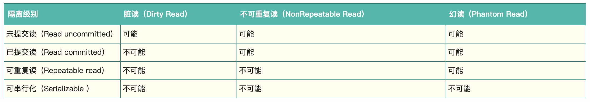
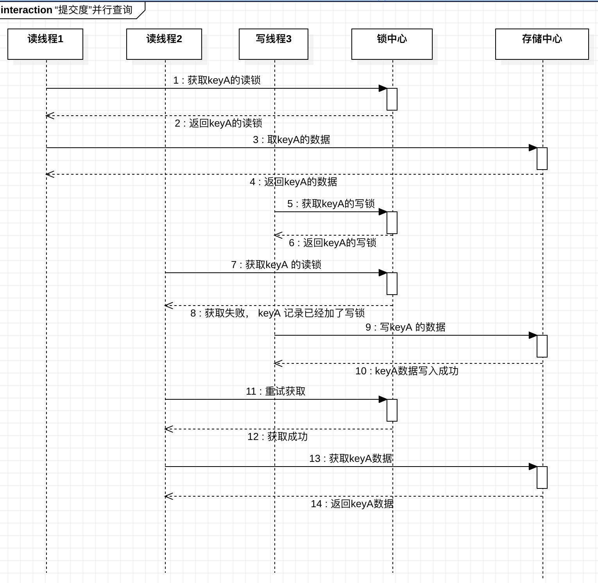

# 事务设计文档
## 背景知识
### innoDb 引擎的事务的隔离级别和错读现象

(图片来自"美团技术团队"博客，如侵权，请告知删除)

## 需求描述
- 支持"提交读"隔离级别的事务。
## 场景描述
### "提交读"

## 设计概要
### 实现方式-二阶段锁
- 加锁阶段：在该阶段可以进行加锁操作。在对任何数据进行读操作之前要申请并获得S锁（共享锁，其它事务可以继续加共享锁，但不能加排它锁），在进行写操作之前要申请并获得X锁（排它锁，其它事务不能再获得任何锁）。加锁不成功，则事务进入等待状态，直到加锁成功才继续执行。
- 解锁阶段：当事务释放了一个封锁以后，事务进入解锁阶段，在该阶段只能进行解锁操作不能再进行加锁操作。
### 锁的粒度
- 行锁：对事务涉及的相关数据行进行锁定。
- 表锁：对整个表进行加锁。锁定了所有的数据行。
### 锁的种类
- 共享锁：读锁。
- 排他锁：写锁。
- 基本场景:
    - 如果事务T1持有对row 的共享锁，则来自某些不同事务T2 对锁的请求将按以下方式处理：

        - T2事务线程请求S锁可以立即被授予。其结果是，无论是T1与T2 持有一个共享锁。

        - T2事务线程请求一个排他锁，则不能立即授予。

    - 如果一个事务T1在某行上拥有一个互斥锁，则不能立即批准某个不同事务T2对任一类型的锁的请求。相反，事务T2必须等待事务T1释放对此行的互斥锁。

- 锁的必要性解释
    - 共享锁
        - 读操作需要获取共享锁，是当其他线程在写时，会堵塞，这样就防止未提交读，避免"脏读"。
        - 同时对其他尝试获取互斥锁的线程起到堵塞作用,这么做是为了读的操作应该是原子的，避免了读的过程中，值被重写了。
    - 互斥锁
        - 一旦获取排他锁，其他线程无法获取任何锁。于写锁互斥是串行写的必要前提。
        - 于读锁互斥，是为了防止未提交读，避免"脏读"。
        
### 事务的上下文
- 事务Id: 线程Id+时间戳。这样就不会冲突了。

### 锁的上下文
- 锁申请者：事务Id

    

